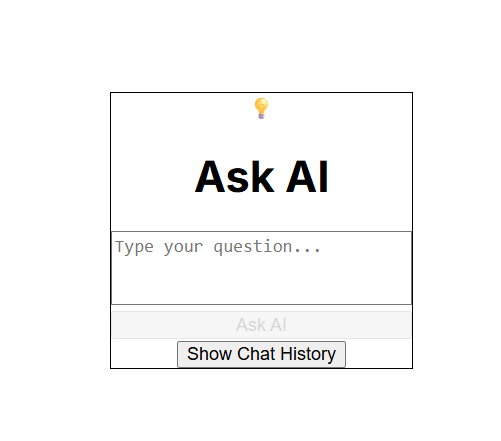

# 🧠 Ask AI – React Frontend with OpenAI Integration

A lightweight, responsive frontend app built with **React** and **Tailwind CSS**, allowing users to ask questions and get real-time responses from OpenAI's GPT-3.5 API.

Includes a bonus **chat history** feature and a clean UI suitable for technical assessments or personal AI tools.

---

## ✨ Features

- 📝 User input text area
- 🚀 “Ask AI” button to trigger API call
- 🤖 AI-generated responses using OpenAI GPT-3.5
- 💬 Chat history with toggle and clear option
- 🖼️ Responsive, card-style layout using Tailwind CSS

---

## 📸 Preview

 <!-- Optional: add your own screenshot -->

---

## 📦 Tech Stack

- [React](https://reactjs.org/)
- [Vite](https://vitejs.dev/)
- [Tailwind CSS](https://tailwindcss.com/)
- [OpenAI API](https://platform.openai.com/docs)

---

## 🚀 Getting Started

Follow these instructions to run the app locally on your machine.

### 1. **Clone the Repository**

```bash
git clone https://github.com/YOUR_USERNAME/ask-ai.git
cd ask-ai
 ```

### 2. Install Dependencies

```
npm install
```

### 3. Setup your OpenAI key (https://platform.openai.com/api-keys)

```
VITE_OPENAI_API_KEY=sk-xxxxxx-your-api-key
```

### 4. Start the app

```
npm run dev
```